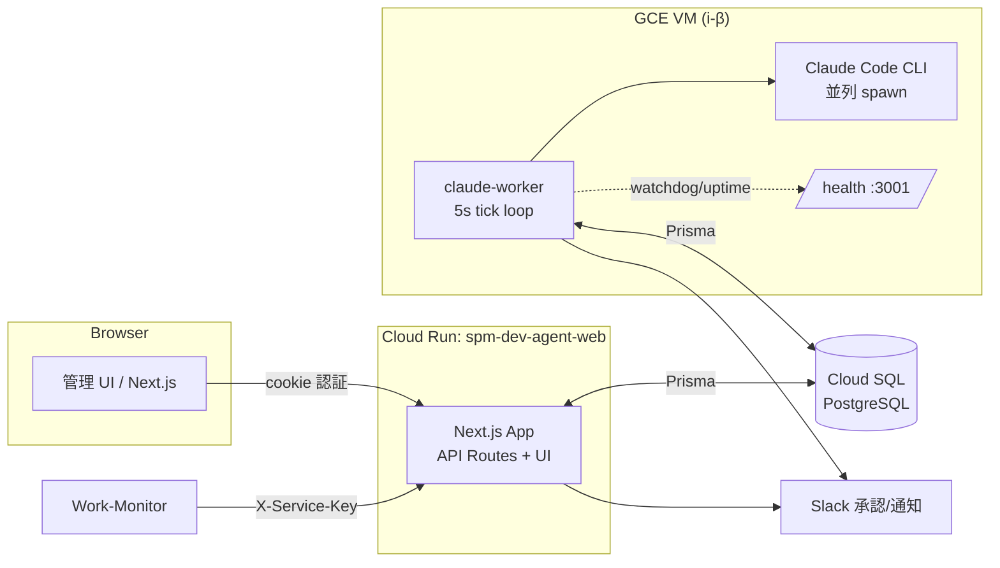

# spm-dev-agent (spm-dev-agent-cloud)

SPM 5 層アーキテクチャの**外側**にある開発メタツール。Web UI からプロジェクト（=開発依頼）を登録すると、VM 上の常駐ワーカーが Claude Code を並列 spawn して実装を進め、Slack 承認フローを挟みながら成果を返す。Work-Monitor からの自動プロジェクト作成（`X-Service-Key`）の受け口でもある。

> 自身は医療データを扱わないが、**生成するコードが SPM Layer1〜5 で動作する**ため、生成物の医療法準拠（認証・監査ログ・暗号化・要配慮個人情報）を設計責任として負う。詳細は `CLAUDE.md` 参照。

## アーキテクチャ



- **Web (Cloud Run)**: 管理 UI と API（`/api/projects`, `/api/execute/*`, `/api/auth/*`, `/api/health`）。
- **Worker (VM)**: `parallel-tick` の `processOneTick()` を 5 秒ごとにポーリングし、`running` プロジェクトのステートマシンを進める常駐プロセス。Claude Code を spawn する都合で Cloud Run ではなく VM 上で動かす。
- **DB**: PostgreSQL（Cloud SQL / Auth Proxy 経由）。Prisma + `@prisma/adapter-pg`。

データフロー・コンポーネント責務の詳細は [docs/architecture.md](docs/architecture.md)。

## 主要機能

- プロジェクト（開発依頼）登録・分類・ポートフォリオ管理
- ドキュメント実行 / 並列実行（parallel-tick ステートマシン）
- Claude Code の並列 spawn・クラッシュ復旧・stale spawn claim 解放
- Slack 承認フロー（DM / チャンネル）
- JWT セッション認証 + サービス間 `X-Service-Key` 認証
- ヘルスチェック（Web `/api/health` / Worker `:3001/health`）と Cloud Monitoring 連携

## セットアップ（開発者向け）

```bash
# 1. 依存インストール
npm ci

# 2. 環境変数（.env.example をコピーして編集）
cp .env.example .env

# 3. Prisma クライアント生成 + DB スキーマ
npx prisma generate
npx prisma migrate dev   # もしくは npx prisma db push

# 4. 開発サーバ（http://localhost:3005）
npm run dev

# 5. ワーカー（別ターミナル）
npm run worker
```

型チェック / lint：

```bash
npx tsc --noEmit
npm run lint
```

## 環境変数

詳細・最新は [.env.example](.env.example) を正とする。

| 変数 | 必須 | 用途 |
|------|------|------|
| `DATABASE_URL` | ✅ | PostgreSQL 接続文字列（Cloud SQL は Auth Proxy 経由 `127.0.0.1:5432`） |
| `ANTHROPIC_API_KEY` | ✅ | Claude API / Claude Code |
| `OPENAI_API_KEY` | ✅(orchestrator) | オーケストレーション用 OpenAI 呼出 |
| `AUTH_SECRET` | ✅ | JWT セッション Cookie 署名 |
| `SERVICE_API_KEY` | ✅ | サービス間認証（`X-Service-Key`）。Work-Monitor と同一値 |
| `SLACK_BOT_TOKEN` / `SLACK_SIGNING_SECRET` | ○ | Slack 承認・通知 |
| `SLACK_APPROVAL_CHANNEL` | ○ | 承認チャンネル ID（既定 `C0B3D1S0LER`） |
| `SKIP_APPROVAL` | ○ | `true` で承認スキップ（開発用） |
| `DATABASE_SSL_CA` / `PGSSLROOTCERT` | ○ | DB TLS の CA 証明書パス |
| `SPM_PROJECTS_ROOT` | ○(VM) | spawn 対象リポの親ディレクトリ。VM では必須 |
| `CLAUDE_BIN` | ○(VM) | claude バイナリパス（未指定は PATH 解決） |
| `HEALTH_PORT` | ○(VM) | Worker `/health` ポート（既定 3001） |

> サーバサイド専用。`NEXT_PUBLIC_` には機密を載せない。`.env` は `.gitignore` 済み。
> VM 特有の `SPM_PROJECTS_ROOT` / `CLAUDE_BIN` の解決順とハマりどころは [docs/runbook.md](docs/runbook.md) を参照。

## デプロイ

### Web（Cloud Run）

`main` への push で `.github/workflows/deploy.yml` が起動し、buildx でイメージを Artifact Registry に push → Cloud Run `spm-dev-agent-web` を更新する。

- Project: `vets-biz-aigen-apps` / Region: `asia-northeast1`
- 必要な GitHub Secrets: `GCP_SA_KEY`（または `GCP_SERVICE_ACCOUNT_KEY`）, `SLACK_WEBHOOK_URL`（任意・失敗通知）
- シークレット値は `gcloud run services update spm-dev-agent-web --set-secrets=...` で別途投入。
- 型チェック/lint は push/PR 時に `.github/workflows/test.yml` が実行（ブランチ保護に登録すると失敗時マージ拒否）。

### Worker（GCE VM / systemd）

VM 上でリポを `/opt/spm-dev-agent` に配置し、以下の systemd unit で常駐させる。`Type=notify` + `WatchdogSec=60` により、ワーカーがハング（DB 到達不能で watchdog ping 停止）すると systemd が自動再起動する。

`/etc/systemd/system/spm-dev-agent-worker.service`:

```ini
[Unit]
Description=SPM dev-agent Claude worker
After=network-online.target
Wants=network-online.target

[Service]
Type=notify
NotifyAccess=all
WorkingDirectory=/opt/spm-dev-agent
ExecStart=/usr/bin/npm run worker
Restart=on-failure
RestartSec=5
WatchdogSec=60
Environment=NODE_ENV=production
Environment=HEALTH_PORT=3001
EnvironmentFile=/etc/spm-dev-agent/worker.env
User=spm
Group=spm

[Install]
WantedBy=multi-user.target
```

Web 本体も VM で動かす場合の `/etc/systemd/system/spm-dev-agent-web.service`:

```ini
[Unit]
Description=SPM dev-agent web
After=network-online.target
Wants=network-online.target

[Service]
Type=simple
WorkingDirectory=/opt/spm-dev-agent
ExecStart=/usr/bin/npm run start
Restart=on-failure
RestartSec=5
Environment=NODE_ENV=production
Environment=PORT=8080
EnvironmentFile=/etc/spm-dev-agent/web.env
User=spm
Group=spm

[Install]
WantedBy=multi-user.target
```

適用：

```bash
sudo systemctl daemon-reload
sudo systemctl enable --now spm-dev-agent-worker
sudo scripts/vm-logs.sh status      # 稼働確認
sudo scripts/vm-logs.sh errors      # 直近のエラー抽出
curl localhost:3001/health          # ワーカーヘルス
```

> PM2 で動かす場合は watchdog（systemd notify）は無効。`pm2 start npm --name claude-worker -- run worker` で起動でき、`Restart` 相当は PM2 が担う。

## 監視・運用

- **ヘルスチェック**: Web `GET /api/health`、Worker `GET :3001/health`（`{status, last_tick, db_connected}`、異常時 503）。
- **ログ閲覧**: `scripts/vm-logs.sh {status|tail|errors|health}`。
- **メトリック/アラート**: `scripts/setup-monitoring.sh` で Cloud Logging メトリック + アラートポリシー（Slack #monitoring）を作成。
- **障害対応 / デバッグ SQL / 並列実行のハマりどころ**: [docs/runbook.md](docs/runbook.md)。
- **内部 API**: [docs/api.md](docs/api.md)。

## medical-pack リソース同期（agents/skills/commands/hooks）

spawn される Claude Code に `spm-medical-pack` の全リソースを参照させる（冪等・symlink）。

```bash
# Mac
bash scripts/sync-claude-resources.sh

# VM (spm-dev-agent-vm)
gcloud compute ssh spm-dev-agent-vm --zone=asia-northeast1-b --quiet \
  --command='cd ~/spm-dev-agent-cloud && git pull --ff-only && bash scripts/sync-claude-resources.sh'
```

詳細: [docs/medical-pack-inventory.md](docs/medical-pack-inventory.md) / [docs/skills-integration.md](docs/skills-integration.md)。

