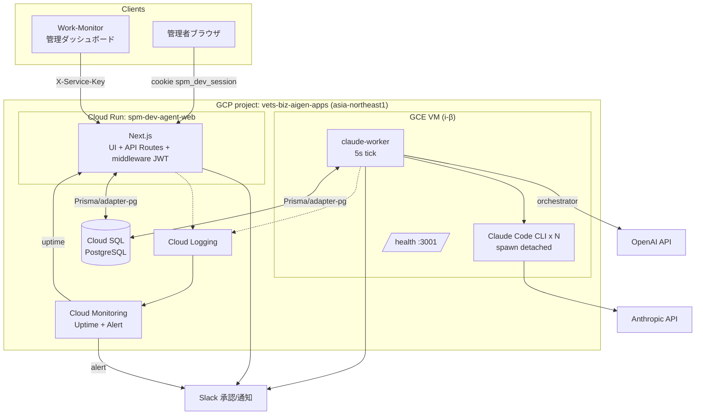
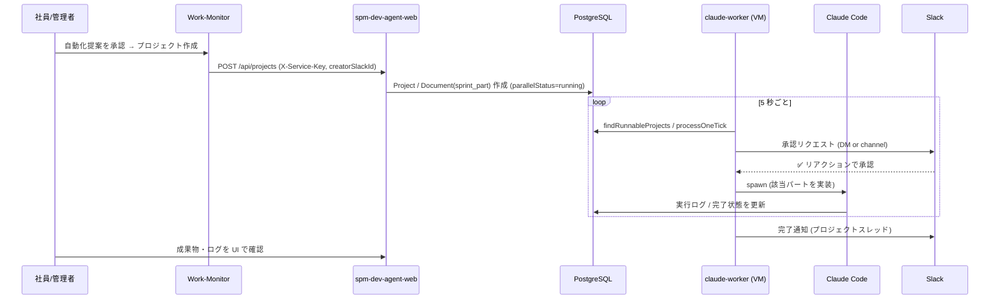

# アーキテクチャ — spm-dev-agent

## 全体構成

## データフロー（社員操作 → 成果物）

## コンポーネント責務

| コンポーネント | 実体 | 責務 |
|----------------|------|------|
| Web (Cloud Run) | `src/app/**`, `src/middleware.ts` | UI 配信、API（プロジェクト CRUD / 実行トリガ / 認証 / health）、JWT セッション検証、`X-Service-Key` 検証 |
| Worker (VM) | `src/workers/claude-worker.ts` | tick ループ、クラッシュ復旧、stale spawn claim 解放、health/ watchdog |
| 並列実行エンジン | `src/lib/parallel-tick.ts` | パートのステートマシン（waiting→approved→executing→done/error）、Claude Code spawn、Slack 承認連携 |
| DB アクセス | `src/lib/prisma.ts` | Prisma クライアント（pg adapter）、接続先に応じた TLS 解決 |
| サービス認証 | `src/lib/api-auth.ts` | `X-Service-Key` の timing-safe 比較 |
| ヘルス | `src/app/api/health/route.ts` / worker 内 HTTP | DB 到達性・直近 tick 鮮度の公開 |

## 信頼性の仕組み

- **Worker watchdog**: `Type=notify` + `WatchdogSec=60`。worker は DB 到達可能な間だけ 30s ごとに `WATCHDOG=1` を送る。ハング（DB 不能/フリーズ）で ping が止まると systemd が再起動。
- **クラッシュ復旧**: 起動時 `recoverFromCrash()` + `recoverStaleSpawnClaims(0)`、稼働中も毎 tick `recoverStaleSpawnClaims(2分)` / `resumeStuckProjects()`。
- **ヘルスチェック**: Web/Worker とも `/health` を持ち、DB 不能時は 503。Cloud Monitoring Uptime Check と LB ヘルスチェックに利用。
- **アラート**: Cloud Logging メトリック（web ERROR 数 / worker 失敗数）→ アラートポリシー → Slack #monitoring。
